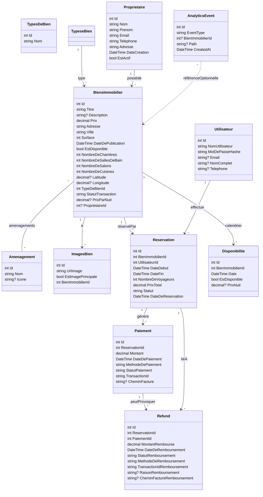
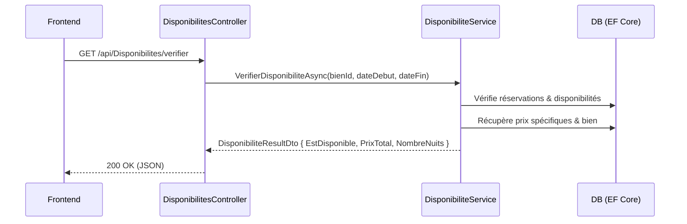
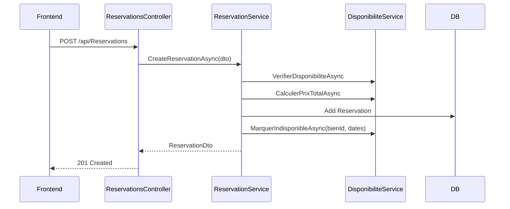
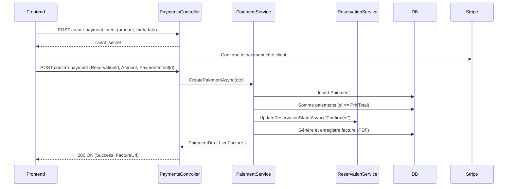
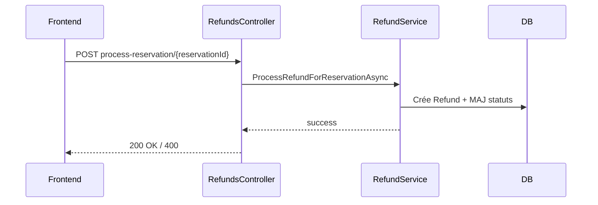

## Architecture fonctionnelle et logique

Ce document présente une vue d’ensemble du backend et du frontend de l’application, le diagramme de classes (domaine métier) et les cas d’utilisation clés avec leur logique.

### Stack
- Backend: ASP.NET Core, Entity Framework Core (SQL Server)
- Frontend: React (React Router), Stripe (paiement), LocalStorage (token)

### Diagramme de classes (domaine)

D
Notes:
- Statuts clés: `Reservation.Statut` [En attente de paiement, Confirmée, Annulée]; `Paiement.StatutPaiement` [Réussi, Échoué, En attente]; `Refund.StatutRemboursement` [En cours, Réussi, Échoué]; `BiensImmobilier.StatutTransaction` [À Louer (Nuit), À Louer (Mois), À Vendre, Vendu, Loué].
- Le prix total d’une réservation est calculé par `DisponibiliteService.CalculerPrixTotalAsync` avec priorité aux `Disponibilite.PrixNuit` puis fallback `BiensImmobilier.PrixParNuit` ou `Prix/30`.

### Principaux endpoints (résumé)
- `AuthController`
  - POST `/api/Auth/login` (admin) ; POST `/api/Auth/client-login` ; POST `/api/Auth/client-register` ; GET `/api/Auth/verify`.
- `BiensImmobiliersController`
  - GET `/api/BiensImmobiliers` (filtres: recherche, type, statut, ville, quartier, prix, dates, voyageurs, propriétaire) ; POST `/api/BiensImmobiliers` ; etc.
- `ReservationsController`
  - POST `/api/Reservations` ; GET `/api/Reservations` ; GET `/api/Reservations/{id}` ; filtres: id, clientId, status, search.
- `DisponibilitesController`
  - GET `/api/Disponibilites/verifier` ; GET `/api/Disponibilites` ; POST `/api/Disponibilites`.
- `PaiementsController`
  - POST `/api/Paiements` ; GET `/api/Paiements` ; GET `/api/Paiements/{id}` ; GET `/api/Paiements/reservation/{reservationId}` ; GET `/api/Paiements/{id}/facture`.
- `PaymentsController` (Stripe)
  - POST `/api/Payments/create-payment-intent` ; POST `/api/Payments/webhook` ; POST `/api/Payments/confirm-payment`.
- `RefundsController`
  - POST `/api/Refunds` ; GET `/api/Refunds` ; GET `/api/Refunds/{id}` ; GET `/api/Refunds/reservation/{reservationId}` ; PUT `/api/Refunds/{id}` ; PUT `/api/Refunds/{id}/confirmer` ; POST `/api/Refunds/process-reservation/{reservationId}`.
- `AnalyticsController`
  - POST `/api/Analytics/site-view` ; POST `/api/Analytics/bien-view/{bienId}` ; GET `/api/Analytics/site/monthly` ; GET `/api/Analytics/bien/{bienId}/monthly` ; GET `/api/Analytics/site/count` ; GET `/api/Analytics/bien/{bienId}/count` ; GET `/api/Analytics/bien/top`.
- `ProprietairesController`, `DashboardController`, `StatsController`, `ContactController`, `AgentController` (proxy IA) disponibles pour fonctions annexes.

## Cas d’utilisation et logique

### UC1. Rechercher et filtrer les biens
1) L’utilisateur (client) saisit des filtres (type, ville, statut, prix, dates, voyageurs).
2) Front appelle GET `/api/BiensImmobiliers` avec query params.
3) `BienImmobilierService.GetAllBiensAsync` applique les filtres, inclut `TypeDeBien`, `Amenagements`, `ImagesBiens`, `Disponibilites` et retourne des DTO légers.

### UC2. Vérifier la disponibilité et calculer le prix
1) Front appelle GET `/api/Disponibilites/verifier` avec `bienImmobilierId`, `dateDebut`, `dateFin`.
2) `DisponibiliteService.VerifierDisponibiliteAsync`:
   - Valide l’intervalle, vérifie chevauchements avec `Reservations` (sauf Annulée) et `Disponibilites` indisponibles.
   - Calcule `PrixTotal` via `CalculerPrixTotalAsync`.

### UC3. Créer une réservation et bloquer les dates
1) Front envoie POST `/api/Reservations` avec `CreateReservationDto` (bien, utilisateur, dates, voyageurs).
2) `ReservationService.CreateReservationAsync`:
   - Re-vérifie la dispo, calcule le prix.
   - Crée `Reservation` (Statut = "Confirmée" par défaut).
   - Marque les dates comme indisponibles via `MarquerIndisponibleAsync`.

### UC4. Paiement Stripe et génération de facture PDF
1) Front crée un PaymentIntent: POST `/api/Payments/create-payment-intent` (montant en centimes, metadata réservation).
2) Stripe retourne un `client_secret` pour confirmer côté front.
3) Après succès, front confirme: POST `/api/Payments/confirm-payment` (ReservationId, Amount, PaymentIntentId).
4) `PaiementService.CreatePaiementAsync`:
   - Crée `Paiement`, met à jour statut de réservation si montant total atteint.
   - Génère facture PDF via iTextSharp, persiste `CheminFacture` et expose `LienFacture`.

### UC5. Annulation et remboursement
1) Front (client ou admin) déclenche POST `/api/Refunds/process-reservation/{reservationId}`.
2) `RefundService.ProcessRefundForReservationAsync` orchestre la création du `Refund`, interaction PSP (selon implémentation), mise à jour des statuts.
3) Optionnel: PUT `/api/Refunds/{id}/confirmer` pour marquer le remboursement comme confirmé.

### UC6. Authentification client et admin
- Client: POST `/api/Auth/client-login` → JWT; stockage `localStorage.authToken`; GET `/api/Auth/verify` pour valider le token.
- Admin: POST `/api/Auth/login` → JWT; le frontend dispose d’un `ProtectedRoute` basé sur la présence du token (à étendre si besoin pour rôles).

### UC7. Analytics (vues site et biens)
- Le frontend envoie des événements: POST `/api/Analytics/site-view` et `/api/Analytics/bien-view/{bienId}`.
- Lecture agrégée mensuelle et comptages via endpoints GET correspondants.

## Frontend (routage et pages)
- Routes principales (`src/App.jsx`):
  - `/` → `ClientHome`
  - `/biens` → `BiensList`
  - `/property/:id` → `PropertyDetailUser`
  - `/reservation/:id` → `ReservationPage`
  - `/mes-reservations` → `MesReservations`
  - `/admin`, `/admin/dashboard` → `AdminDashboard` (peut être protégé par `ProtectedRoute`)

Interactions notables:
- `ReservationPage` intègre Stripe (`@stripe/react-stripe-js`) et consomme `PaymentsController` pour PaymentIntent et confirmation.
- `ClientLoginModal` consomme `/api/Auth/client-login` et écrit le token.

## Remarques de conception
- Les services backend encapsulent la logique métier: disponibilités, calculs, paiements, remboursements, analytics.
- Les contrôleurs restent fins et délèguent aux services.
- CORS ouvert en dev; prévoir un durcissement en prod.
- Facturation PDF générée côté serveur et servie depuis `wwwroot/factures`.

## Évolutions suggérées (rapides)
- Ajouter un rôle/claim pour distinguer Admin/Client et protéger les routes Admin côté API et Front.
- Gérer l’idempotence des paiements et des remboursements (duplicate handling).
- Webhook Stripe: compléter la MAJ de réservation au succès/échec.

