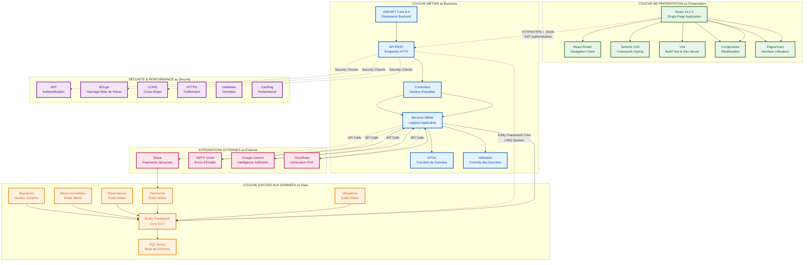
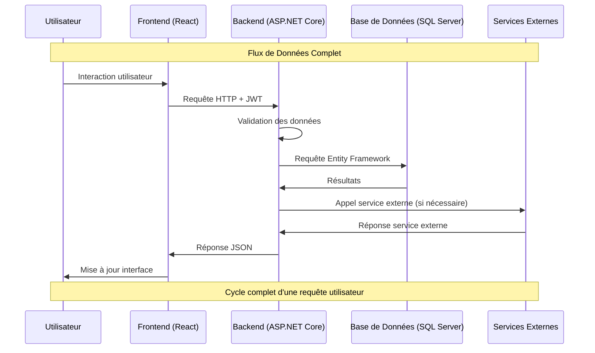
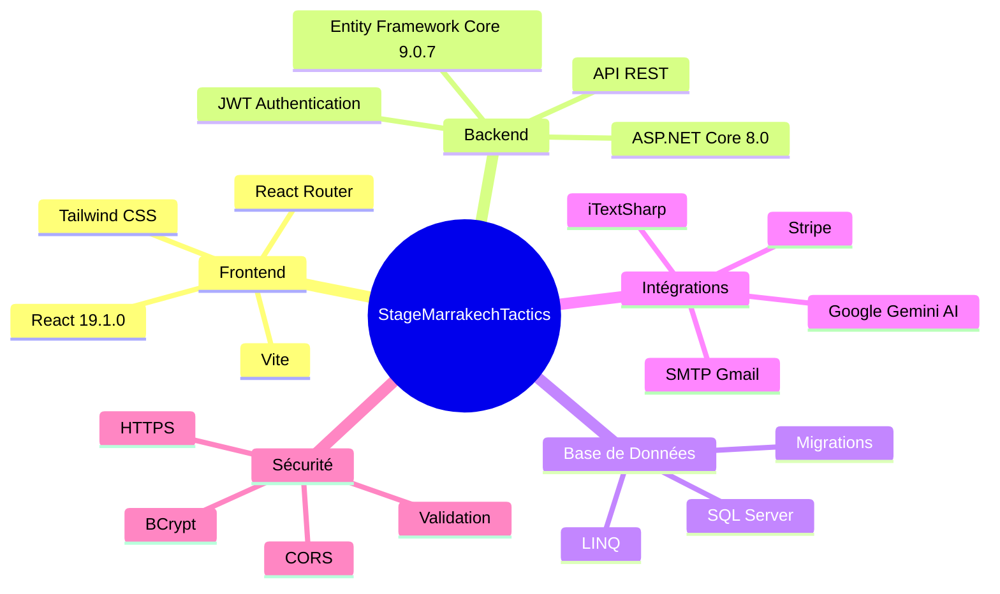
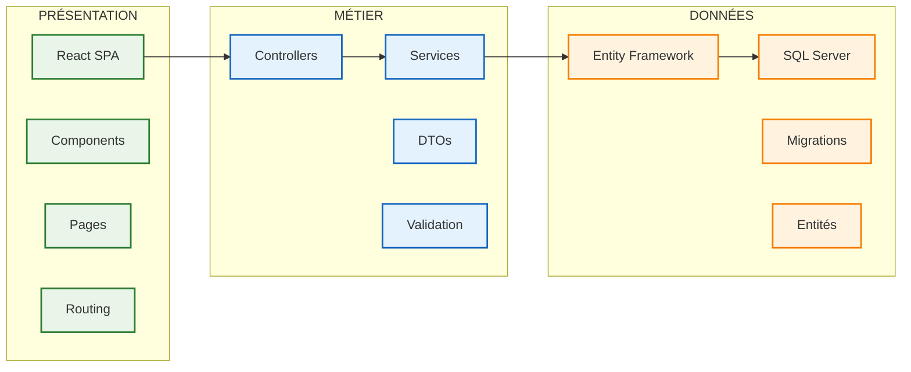

# Schéma d'Architecture - StageMarrakechTactics

## Architecture en Couches (Version Améliorée)

## Flux de Données Détaillé

## Technologies Utilisées (Mindmap Amélioré)

## Architecture Détaillée par Couche

