# Diagramme de Cas d'Utilisation - Application de Gestion Immobilière

## Diagramme Mermaid

```mermaid
graph TB
    subgraph "Acteurs Externes"
        Client[👤 Client]
        Admin[👨‍💼 Administrateur]
        Proprietaire[🏠 Propriétaire]
        Stripe[💳 Stripe Payment]
    end

    subgraph "Système de Gestion Immobilière"
        subgraph "Gestion des Biens"
            UC1[UC1: Rechercher et filtrer les biens]
            UC2[UC2: Consulter les détails d'un bien]
            UC3[UC3: Gérer les biens immobiliers]
            UC4[UC4: Gérer les propriétaires]
        end

        subgraph "Gestion des Réservations"
            UC5[UC5: Vérifier la disponibilité]
            UC6[UC6: Calculer le prix total]
            UC7[UC7: Créer une réservation]
            UC8[UC8: Annuler une réservation]
            UC9[UC9: Consulter mes réservations]
        end

        subgraph "Système de Paiement"
            UC10[UC10: Effectuer un paiement]
            UC11[UC11: Générer une facture PDF]
            UC12[UC12: Traiter un remboursement]
            UC13[UC13: Consulter l'historique des paiements]
        end

        subgraph "Authentification et Autorisation"
            UC14[UC14: Se connecter]
            UC15[UC15: S'inscrire]
            UC16[UC16: Se déconnecter]
            UC17[UC17: Gérer le profil utilisateur]
        end

        subgraph "Gestion des Disponibilités"
            UC18[UC18: Gérer le calendrier de disponibilités]
            UC19[UC19: Définir des prix spécifiques]
            UC20[UC20: Vérifier les chevauchements]
        end

        subgraph "Analytics et Reporting"
            UC21[UC21: Consulter les statistiques]
            UC22[UC22: Suivre les vues de biens]
            UC23[UC23: Générer des rapports]
        end

        subgraph "Administration"
            UC24[UC24: Gérer les utilisateurs]
            UC25[UC25: Consulter le dashboard admin]
            UC26[UC26: Gérer les types de biens]
        end
    end

    %% Relations Client
    Client --> UC1
    Client --> UC2
    Client --> UC5
    Client --> UC6
    Client --> UC7
    Client --> UC8
    Client --> UC9
    Client --> UC10
    Client --> UC11
    Client --> UC13
    Client --> UC14
    Client --> UC15
    Client --> UC16
    Client --> UC17

    %% Relations Admin
    Admin --> UC3
    Admin --> UC4
    Admin --> UC18
    Admin --> UC19
    Admin --> UC21
    Admin --> UC22
    Admin --> UC23
    Admin --> UC24
    Admin --> UC25
    Admin --> UC26
    Admin --> UC14
    Admin --> UC16

    %% Relations Propriétaire
    Proprietaire --> UC3
    Proprietaire --> UC18
    Proprietaire --> UC19
    Proprietaire --> UC21
    Proprietaire --> UC14
    Proprietaire --> UC16

    %% Relations Stripe
    Stripe --> UC10
    Stripe --> UC12

    %% Relations internes (dépendances)
    UC7 -.-> UC5
    UC7 -.-> UC6
    UC10 -.-> UC7
    UC11 -.-> UC10
    UC12 -.-> UC8
    UC20 -.-> UC5
    UC19 -.-> UC6
    UC22 -.-> UC2
    UC21 -.-> UC22
    UC25 -.-> UC21
    UC25 -.-> UC23

    %% Styles
    classDef actor fill:#e1f5fe,stroke:#01579b,stroke-width:2px
    classDef useCase fill:#f3e5f5,stroke:#4a148c,stroke-width:2px
    classDef system fill:#e8f5e8,stroke:#1b5e20,stroke-width:3px

    class Client,Admin,Proprietaire,Stripe actor
    class UC1,UC2,UC3,UC4,UC5,UC6,UC7,UC8,UC9,UC10,UC11,UC12,UC13,UC14,UC15,UC16,UC17,UC18,UC19,UC20,UC21,UC22,UC23,UC24,UC25,UC26 useCase
```

## Description Détaillée des Cas d'Utilisation

### **Acteurs**

#### **Client**
- Utilisateur final qui consulte, réserve et paie des biens immobiliers
- Peut gérer son profil et consulter son historique de réservations

#### **Administrateur**
- Gère l'ensemble du système, les biens, les utilisateurs et les statistiques
- Accès complet à toutes les fonctionnalités d'administration

#### **Propriétaire**
- Gère ses propres biens immobiliers
- Consulte les statistiques de ses biens

#### **Stripe Payment**
- Système externe de paiement pour traiter les transactions

### **Cas d'Utilisation Principaux**

#### **Gestion des Biens**
- **UC1**: Recherche multi-critères (type, ville, prix, dates, etc.)
- **UC2**: Consultation détaillée avec images, aménagements, localisation
- **UC3**: CRUD des biens (Admin/Propriétaire)
- **UC4**: Gestion des propriétaires (Admin)

#### **Gestion des Réservations**
- **UC5**: Vérification de disponibilité par calendrier
- **UC6**: Calcul dynamique du prix total
- **UC7**: Création de réservation avec blocage des dates
- **UC8**: Annulation de réservation
- **UC9**: Consultation de l'historique des réservations

#### **Système de Paiement**
- **UC10**: Paiement sécurisé via Stripe
- **UC11**: Génération automatique de factures PDF
- **UC12**: Traitement des remboursements
- **UC13**: Consultation de l'historique des paiements

#### **Authentification**
- **UC14**: Connexion utilisateur
- **UC15**: Inscription client
- **UC16**: Déconnexion
- **UC17**: Gestion du profil utilisateur

#### **Gestion des Disponibilités**
- **UC18**: Gestion du calendrier de disponibilités
- **UC19**: Définition de prix spécifiques par période
- **UC20**: Vérification des chevauchements de réservations

#### **Analytics et Reporting**
- **UC21**: Consultation des statistiques globales
- **UC22**: Suivi des vues de biens
- **UC23**: Génération de rapports

#### **Administration**
- **UC24**: Gestion des utilisateurs
- **UC25**: Dashboard administrateur
- **UC26**: Gestion des types de biens

### **Relations et Dépendances**

- Les cas d'utilisation sont organisés en modules logiques
- Les flèches en pointillés indiquent les dépendances entre cas d'utilisation
- Chaque acteur a des permissions spécifiques selon son rôle
- Le système intègre des services externes (Stripe) pour les paiements

### **Points Clés du Diagramme**

1. **Séparation des rôles** : Chaque acteur a des responsabilités bien définies
2. **Flux logique** : Les cas d'utilisation suivent le parcours utilisateur naturel
3. **Intégration externe** : Prise en compte des services tiers (Stripe)
4. **Modularité** : Organisation en sous-systèmes cohérents
5. **Traçabilité** : Relations claires entre les différents cas d'utilisation

---

*Ce diagramme représente la vue logique des cas d'utilisation de l'application de gestion immobilière, organisée selon les besoins fonctionnels identifiés.*

