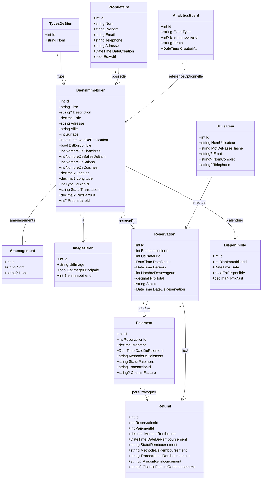
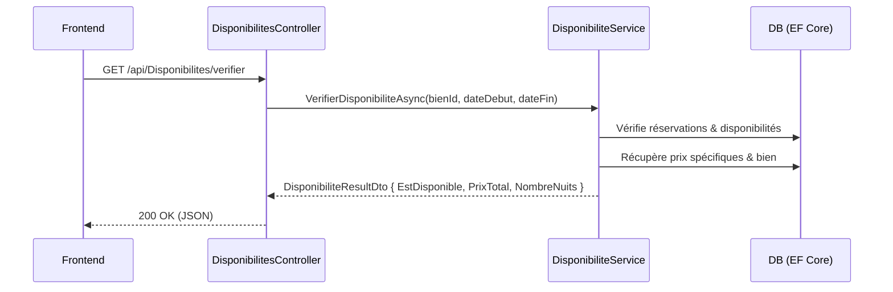
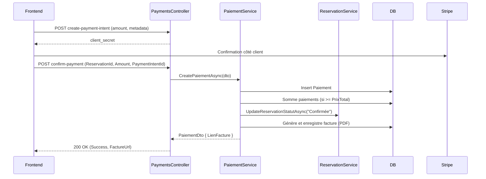

## Page de garde

- **Sujet**: Conception et réalisation d’une application Full-Stack de gestion de biens immobiliers (recherche, réservation, paiement, facturation, analytics)
- **Entreprise d’accueil**: « À compléter »
- **Encadrant entreprise**: « À compléter »
- **Encadrant pédagogique**: « À compléter »
- **Étudiant(e)**: « À compléter »
- **Année**: « À compléter »

## Remerciements

Je tiens à remercier « À compléter (équipe, encadrants, collaborateurs) » pour leur accompagnement et leurs conseils tout au long de ce projet.

## Résumé

Ce rapport présente la conception et la mise en œuvre d’une application web de gestion immobilière permettant la consultation de biens, la recherche multi‑critères, la réservation avec vérification de disponibilité et le paiement en ligne, ainsi que la génération de factures et le suivi d’analytics. L’architecture repose sur un backend ASP.NET Core et un frontend React, avec intégration Stripe pour les paiements et stockage de jetons JWT côté client. Le document couvre l’analyse des besoins, la conception (diagrammes de classes et de séquence), l’architecture technique, la réalisation, les tests, le déploiement et les perspectives d’évolution.

Mots‑clés: Immobilier, Réservation, Paiement en ligne, ASP.NET Core, React, Stripe, PDF, Analytics.

## Abstract (EN)

This report describes the design and implementation of a real estate web application enabling property browsing, multi‑criteria search, availability checking and booking, online payments, invoice generation, and basic analytics. The system is built with ASP.NET Core (backend) and React (frontend), integrates Stripe for payments, and uses JWT on the client side. The document covers requirements, design (class and sequence diagrams), technical architecture, implementation, testing, deployment, and future work.

Keywords: Real estate, Booking, Online payment, ASP.NET Core, React, Stripe, PDF, Analytics.

## Table des matières

1. Introduction Générale
2. Présentation de l’entreprise d’accueil
3. Cahier des charges et objectifs
4. Analyse et conception
5. Architecture technique
6. Réalisation
7. Tests et validation
8. Déploiement
9. Gestion de projet
10. Difficultés rencontrées et solutions
11. Résultats et démonstration
12. Améliorations et perspectives
13. Conclusion
14. Annexes

## 1. Introduction Générale

Le projet présenté dans ce rapport a pour objectif de digitaliser de bout en bout le parcours de location/vente de biens immobiliers. Il répond à un besoin concret: offrir une plateforme unique permettant aux clients de découvrir des biens, vérifier leurs disponibilités sur des plages précises, réserver en ligne et régler leurs séjours de manière sécurisée, tandis que les administrateurs et propriétaires disposent d’outils pour publier, maintenir et suivre leurs biens et leurs performances.

Sur le plan fonctionnel, l’application propose:
- la recherche multi‑critères (type de bien, ville, statut, prix, dates, nombre de voyageurs) et la consultation de fiches détaillées (médias, aménagements, localisation) ;
- la vérification de la disponibilité par calendrier et le calcul du prix total avec priorisation des tarifs spécifiques par date ;
- la création de réservations et le blocage automatique des dates concernées ;
- l’encaissement en ligne via Stripe (création/confirmation de PaymentIntent), suivi de la génération d’une facture PDF accessible au client ;
- la gestion des annulations et des remboursements lorsque le contexte l’exige ;
- une authentification par JWT et des espaces dédiés (client: historique de réservations ; admin: gestion des biens, des disponibilités et consultation d’indicateurs).

Sur le plan technique, la solution s’appuie sur un backend ASP.NET Core et Entity Framework Core (SQL Server) pour la logique métier et la persistance, et un frontend React pour l’interface utilisateur. L’intégration Stripe assure la fiabilité du paiement, tandis que la génération de factures PDF et les événements d’analytics apportent traçabilité et visibilité. Les choix d’architecture (services métiers, contrôleurs fins, DTO) visent la maintenabilité, l’extensibilité (ajout de rôles/claims, webhooks Stripe) et la sécurité (JWT, CORS maîtrisé en production).

Le document est organisé comme suit: présentation du contexte et de l’entreprise d’accueil, cahier des charges et objectifs, analyse et conception (diagrammes et cas d’utilisation), architecture technique et endpoints, réalisation (backend, frontend, paiements/remboursements), tests et validation, déploiement et gestion de projet, difficultés rencontrées, résultats, puis améliorations et perspectives, avant la conclusion.

## 2. Présentation de l’entreprise d’accueil

- **Nom**: « À compléter »
- **Secteur d’activité**: « À compléter »
- **Mission et vision**: « À compléter »
- **Organisation / Équipe**: « À compléter »
- **Technologies et environnement**: « À compléter »

Note: Cette section sera personnalisée dès réception de la description officielle de l’entreprise.

## 3. Cahier des charges et objectifs

- **Besoins fonctionnels**:
  - Recherche et filtrage des biens (par type, ville, statut, prix, etc.).
  - Vérification de la disponibilité et calcul du prix selon un calendrier.
  - Création de réservations et blocage des dates.
  - Paiement en ligne (Stripe), génération et mise à disposition de factures PDF.
  - Remboursements et gestion des annulations.
  - Authentification (client et admin) avec JWT, zones protégées.
  - Suivi des vues (site et biens) et agrégations mensuelles.
- **Besoins non fonctionnels**:
  - Sécurité de l’API (JWT, CORS maîtrisé en prod).
  - Maintenabilité (services métiers, contrôleurs fins).
  - Extensibilité (rôles, webhooks Stripe, idempotence des paiements).
  - Performance raisonnable (requêtes filtrées et projections DTO).

## 4. Analyse et conception

### 4.1 Modèle du domaine (diagramme de classes)

**Notes :**
- **Statuts clés** : `Reservation.Statut` [En attente de paiement, Confirmée, Annulée]; `Paiement.StatutPaiement` [Réussi, Échoué, En attente]; `Refund.StatutRemboursement` [En cours, Réussi, Échoué]; `BiensImmobilier.StatutTransaction` [À Louer (Nuit), À Louer (Mois), À Vendre, Vendu, Loué].
- **Calcul du prix total** : priorité aux prix spécifiques du calendrier (`Disponibilite.PrixNuit`), sinon `BiensImmobilier.PrixParNuit` ou `Prix/30`.
- **Relations** : Toutes les relations sont basées sur les clés étrangères et les propriétés de navigation Entity Framework.

### 4.2 Cas d’utilisation (extraits)

- **UC1 – Rechercher et filtrer les biens**: saisie des filtres → GET `/api/BiensImmobiliers` → service applique filtres et retourne DTO.
- **UC2 – Vérifier la disponibilité et calculer le prix**: GET `/api/Disponibilites/verifier` → validations, vérification chevauchements, calcul `PrixTotal`.
- **UC3 – Créer une réservation et bloquer les dates**: POST `/api/Reservations` → re‑vérif dispo, calcul prix, création réservation, marquage indisponibilités.
- **UC4 – Paiement Stripe et facture PDF**: création `PaymentIntent`, confirmation, enregistrement paiement, génération facture PDF.
- **UC5 – Annulation et remboursement**: déclenchement remboursement par réservation, mise à jour statuts.
- **UC6 – Authentification**: clients et admin via JWT; front protège les routes admin.
- **UC7 – Analytics**: envoi d’événements de vues et lecture agrégée.

#### Diagrammes de séquence (exemples)

Disponibilité et prix:

Paiement et facture:

## 5. Architecture technique

### 5.1 Stack

- **Backend**: ASP.NET Core, Entity Framework Core (SQL Server)
- **Frontend**: React (React Router)
- **Paiement**: Stripe (PaymentIntent, webhook à étendre)
- **Stockage client**: LocalStorage pour le token JWT

### 5.2 Endpoints principaux (résumé)

- `AuthController`: POST `/api/Auth/login`, `/api/Auth/client-login`, `/api/Auth/client-register`, GET `/api/Auth/verify`.
- `BiensImmobiliersController`: GET `/api/BiensImmobiliers` (filtres…), POST `/api/BiensImmobiliers`, etc.
- `ReservationsController`: POST `/api/Reservations`, GET `/api/Reservations`, GET `/api/Reservations/{id}`.
- `DisponibilitesController`: GET `/api/Disponibilites/verifier`, GET/POST `/api/Disponibilites`.
- `PaiementsController`: POST/GET `/api/Paiements`, GET `/api/Paiements/{id}`, `/api/Paiements/reservation/{reservationId}`, `/api/Paiements/{id}/facture`.
- `PaymentsController` (Stripe): POST `/api/Payments/create-payment-intent`, `/api/Payments/webhook`, `/api/Payments/confirm-payment`.
- `RefundsController`: POST/GET `/api/Refunds`, GET `/api/Refunds/{id}`, `/api/Refunds/reservation/{reservationId}`, PUT `/{id}`, PUT `/{id}/confirmer`, POST `/api/Refunds/process-reservation/{reservationId}`.
- `AnalyticsController`: POST vues site/biens, GET agrégations mensuelles et compteurs.

## 6. Réalisation

### 6.1 Backend (ASP.NET Core)

- **Services métiers**: disponibilités (vérification/chevauchements, calcul des prix), réservations (création, MAJ statuts), paiements (somme des paiements, facture PDF via iTextSharp), remboursements, analytics.
- **Contrôleurs fins**: délèguent la logique aux services; retour de DTO adaptés.
- **Facturation PDF**: génération côté serveur, persistance du chemin et exposition du lien public (ex. `wwwroot/factures`).
- **Sécurité**: JWT, endpoints de vérification, CORS ouvert en dev (durcissement recommandé en prod).

### 6.2 Frontend (React)

- **Routage clé**:
  - `/` → Accueil client
  - `/biens` → Liste des biens
  - `/property/:id` → Détail d’un bien
  - `/reservation/:id` → Réservation et paiement (Stripe)
  - `/mes-reservations` → Espace client
  - `/admin`, `/admin/dashboard` → Espace admin (via `ProtectedRoute`)
- **Intégrations**:
  - Stripe (`@stripe/react-stripe-js`) pour l’UI de paiement.
  - Authentification client via `/api/Auth/client-login` et stockage du token.
  - Traçage d’analytics via endpoints dédiés.

### 6.3 Paiement et remboursement

- **Paiement**: création de `PaymentIntent`, confirmation, création d’un `Paiement`, mise à jour du statut de la réservation, génération de facture PDF.
- **Remboursement**: orchestration via `RefundsController` et service dédié; confirmation optionnelle.

## 7. Tests et validation

- **Tests unitaires/service**: vérification du calcul de prix, des règles de disponibilité (chevauchements, plages), des transitions de statuts de réservation/paiement.
- **Tests d’intégration**: parcours de réservation complet (recherche → vérification → réservation → paiement → facture).
- **Validation UX**: revue des écrans principaux, contrôles des erreurs et messages utilisateurs.

## 8. Déploiement

- **Environnement de développement**: API .NET + SQL Server local, frontend React (dev server), CORS ouvert.
- **Recommandations production**:
  - Durcir CORS et les en‑têtes de sécurité.
  - Gérer les secrets (clés Stripe, JWT) via vault/variables d’environnement.
  - Webhook Stripe totalement implémenté pour idempotence et robustesse.
  - Stockage persistant des factures et sauvegardes régulières.

## 9. Gestion de projet

### 9.1 Organisation de l'équipe

Notre équipe de développement était composée de deux personnes, ce qui nous a permis d'adopter une approche agile simplifiée adaptée à notre contexte. Nous n'avons pas utilisé de méthodologie Scrum formelle, mais plutôt une approche itérative basée sur la communication directe et la collaboration étroite.

### 9.2 Méthodologie de travail

**Approche itérative et collaborative :**
- Développement en binôme avec répartition des tâches selon les compétences
- Communication directe et quotidienne pour synchroniser nos avancées
- Réunions informelles régulières pour faire le point sur les difficultés et ajuster les priorités
- Développement en parallèle : backend et frontend développés simultanément avec des points de synchronisation

**Répartition des responsabilités :**
- **Développeur 1** : Backend ASP.NET Core, API REST, base de données, services métiers
- **Développeur 2** : Frontend React, interface utilisateur, intégration Stripe, tests utilisateur

### 9.3 Outils et pratiques

**Gestion de version :**
- **GitHub** comme plateforme centrale de collaboration
- Utilisation de branches feature pour isoler les développements
- Pull requests pour la revue de code mutuelle
- Commits réguliers avec messages descriptifs
- Tags pour marquer les versions importantes

**Communication et suivi :**
- Discussions directes et partage d'écran pour les points techniques complexes
- Documentation partagée via les issues GitHub
- Utilisation des commentaires de code pour expliquer les choix d'implémentation

### 9.4 Planning et phases de développement

**Phase 1 (Semaines 1-2) : Cadrage et conception**
- Analyse des besoins et rédaction du cahier des charges
- Conception de l'architecture technique
- Modélisation de la base de données
- Mise en place de l'environnement de développement

**Phase 2 (Semaines 3-5) : Développement backend**
- Implémentation des modèles de données et migrations
- Développement des contrôleurs API
- Mise en place de l'authentification JWT
- Tests unitaires des services métiers

**Phase 3 (Semaines 6-7) : Développement frontend**
- Création des composants React
- Intégration avec l'API backend
- Implémentation de l'interface utilisateur
- Intégration du système de paiement Stripe

**Phase 4 (Semaine 8) : Intégration et finalisation**
- Tests d'intégration end-to-end
- Correction des bugs et optimisations
- Documentation technique et utilisateur
- Préparation de la démonstration

### 9.5 Avantages et défis de l'équipe réduite

**Avantages :**
- Communication directe et efficace
- Flexibilité dans l'adaptation des priorités
- Responsabilité partagée sur l'ensemble du projet
- Décisions rapides sans processus bureaucratique

**Défis rencontrés :**
- Nécessité de maîtriser l'ensemble de la stack technique
- Gestion du temps entre développement et coordination
- Absence de revue de code externe (compensée par la revue mutuelle)
- Risque de "tunnel" sur certaines fonctionnalités

### 9.6 Leçons apprises

Cette expérience de développement en équipe de deux personnes nous a permis de :
- Développer une communication efficace et des pratiques de collaboration
- Apprendre à gérer les dépendances entre frontend et backend
- Comprendre l'importance d'une documentation claire et partagée
- Valider l'efficacité d'une approche agile simplifiée pour les petits projets

## 10. Difficultés rencontrées et solutions

- **Calcul de prix multi‑sources**: prioriser `Disponibilite.PrixNuit` puis fallback au prix par nuit du bien; tests de validation des cas limites.
- **Chevauchement réservations/disponibilités**: règles explicites et vérifications en base.
- **Robustesse des paiements**: prévoir idempotence et gestion des duplications; compléter le webhook Stripe en prod.
- **Facturation PDF**: génération fiable et mise à disposition via lien public sécurisé.

## 11. Résultats et démonstration

- L’application couvre le parcours utilisateur: recherche → vérification → réservation → paiement → facture → suivi analytics.
- Les endpoints clés et les flux critiques ont été validés par des tests et des essais manuels.

## 12. Améliorations et perspectives

- Ajout de rôles/claims pour distinguer Admin/Client et protection côté API et Front.
- Idempotence systématique des paiements et remboursements.
- Webhook Stripe complet avec MAJ de réservation au succès/échec.
- Extensions UX: filtres avancés, carte interactive, notifications.

## 13. Conclusion

Le projet atteint ses objectifs principaux avec une architecture claire, une séparation nette des responsabilités et une intégration des services tiers (Stripe) efficace. Les perspectives d’évolution identifiées permettront d’industrialiser et de sécuriser davantage la solution en production.

## 14. Annexes

### A. Endpoints (rappel)

- Auth, Biens, Réservations, Disponibilités, Paiements, Stripe Payments, Remboursements, Analytics (voir section 5.2).

### B. Captures d’écran (à insérer)

- Accueil, liste des biens, page détail, réservation/paiement, dashboard admin, factures.

### C. Configuration (exemples)

- Variables d’environnement: clés Stripe, JWT secret, chaîne de connexion SQL Server.
- Stratégie CORS par environnement.

