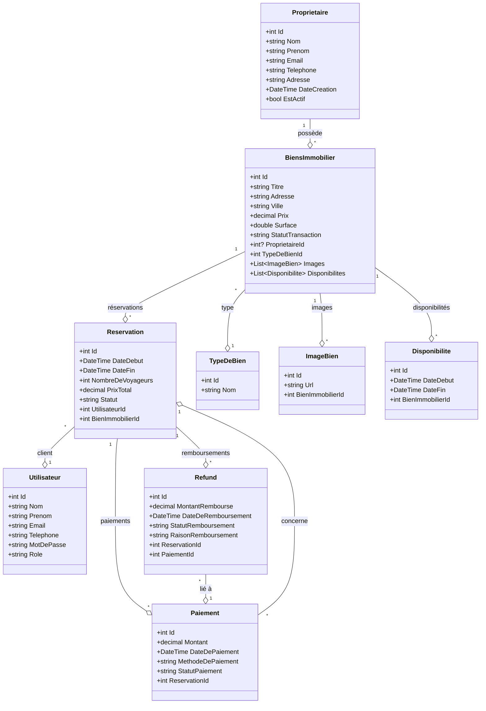

# Diagrammes UML du projet Marrakech Tactics

Ce fichier contient deux diagrammes Mermaid :
- Un diagramme de classes (structure principale de la base de données et des entités)
- Un diagramme de cas d'utilisation (Use Case) pour les principaux rôles

---

## 1. Diagramme de classes (UML)



---

## 2. Diagramme de cas d'utilisation (Use Case)

```mermaid
usecaseDiagram
    actor Admin as A
    actor Client as C
    actor Proprietaire as P

    A --> (Gérer les biens immobiliers)
    A --> (Gérer les propriétaires)
    A --> (Gérer les utilisateurs)
    A --> (Gérer les réservations)
    A --> (Gérer les paiements)
    A --> (Gérer les remboursements)
    A --> (Consulter les statistiques)

    P --> (Consulter ses biens)
    P --> (Ajouter un bien)
    P --> (Modifier un bien)
    P --> (Consulter ses réservations)

    C --> (Rechercher un bien)
    C --> (Consulter les détails d'un bien)
    C --> (Faire une réservation)
    C --> (Payer une réservation)
    C --> (Annuler une réservation)
    C --> (Consulter ses réservations)
```

---

> **Astuce :** Vous pouvez visualiser ces diagrammes sur GitHub, VS Code (avec l'extension Mermaid), ou sur [mermaid.live](https://mermaid.live/).
